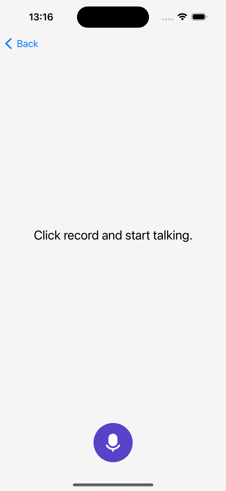

# KMMTranslator - Android and IOS Translator App

Disclaimer: This app was developed purely for learning purposes.

## Overview
**KMMTranslator** is a translator app for Android and IOS build with Kotlin Multiplatform (Mobile) technology.
Use this app to translate texts from and to various languages using keyboard input as well as text-to-speech with a voice recognition feature.

KMMTranslator shares crucial business logic between Android and IOS like models, view models, use cases, api implementations and implements the ui via the platform specific frameworks Jetpack Compose and SwiftUI.

## Features

- **Kotlin**
- **Jetpack Compose**
- **Swift**
- **SwiftUI**
- **MVI Architecture**
- **Coroutines**
- **Flows**
- **SqlDelight**
- **Dagger Hilt**
- **Unit Testing**
- **End-to-End Testing**
- **Text-to-Speech and Voice Recognition**

## Screenshots

    

   

